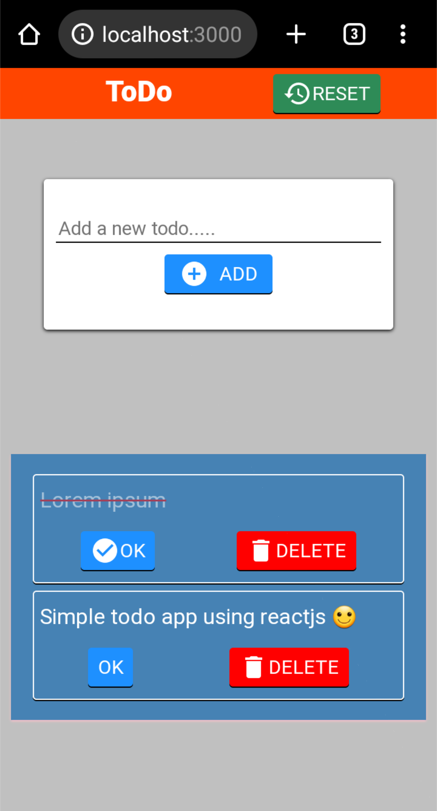

TO DO app using reactjs (by me) v.0.2
====================================
 Screenshot
 

I followed these 2 steps which made development easier.

- First created the UI design using only HTML,CSS
- Then converted it to reactjs

-> I used 'Lifting State Up' pattern to manage the states.

-> Last update: added HTML design in empty TODO text 
